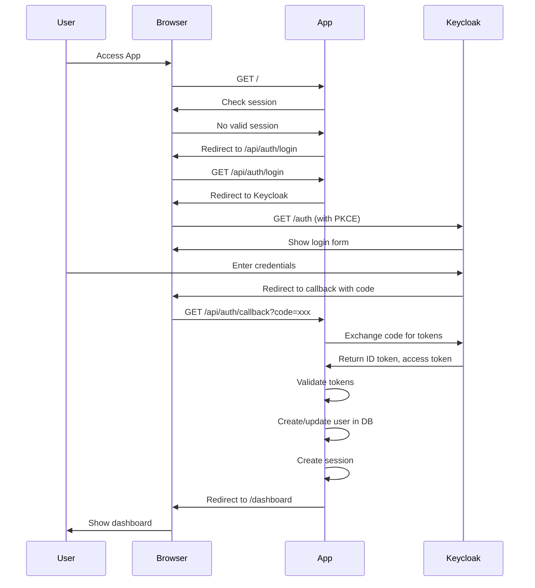
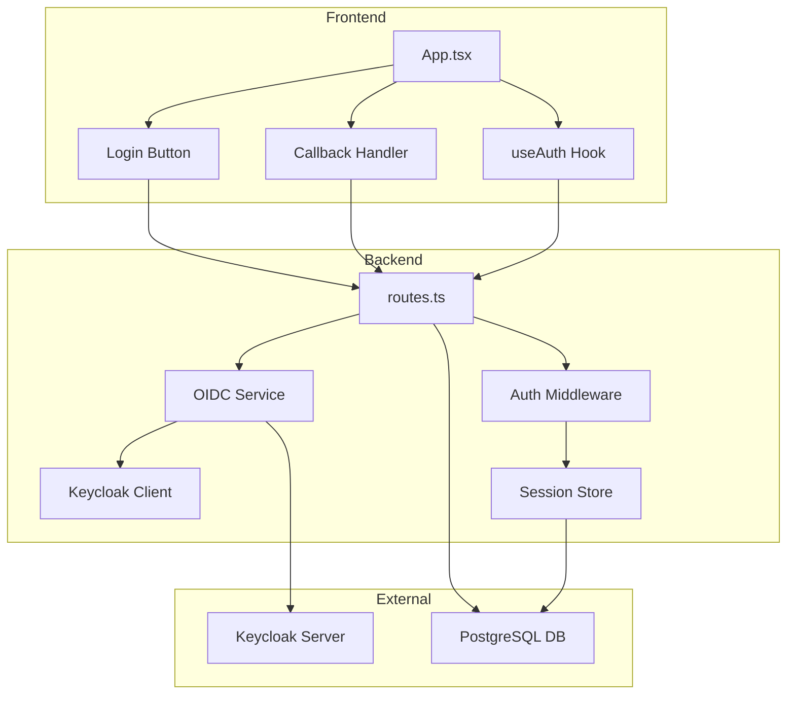

# Keycloak OIDC Authentication Implementation Plan

## Overview
This document outlines the plan to integrate Keycloak OIDC authentication into the Sapphire Healthcare application, replacing the existing username/password authentication system.

## Current State Analysis

### Existing Authentication
- **Type**: Session-based username/password authentication
- **Session Management**: express-session with in-memory store
- **User Storage**: PostgreSQL database with password field
- **Frontend**: Custom login form with email/password
- **Dependencies**: Already has `openid-client` package installed

### Target State
- **Type**: OIDC (OpenID Connect) with Keycloak
- **Flow**: Authorization Code Flow with PKCE (for public client)
- **Session Management**: Server-side sessions with OIDC tokens
- **User Storage**: PostgreSQL with Keycloak user ID mapping
- **Frontend**: Redirect to Keycloak login page

## Architecture

### Authentication Flow



### Component Architecture



## Implementation Steps

### 1. Keycloak Configuration

#### Client Settings in Keycloak Admin Console
Navigate to: Keycloak Admin Console → Clients → sapphire-ui

**Required Settings:**
- **Client ID**: `sapphire-ui`
- **Client Protocol**: `openid-connect`
- **Access Type**: `public` (no client secret needed)
- **Standard Flow Enabled**: `ON`
- **Direct Access Grants Enabled**: `OFF`
- **Valid Redirect URIs**: 
  - `http://localhost:5000/api/auth/callback`
  - `http://localhost:5000/*` (for development)
- **Web Origins**: `http://localhost:5000`
- **Root URL**: `http://localhost:5000`
- **Base URL**: `/`

#### Realm Settings
- **Realm Name**: `sapphire-ui`
- **Login Theme**: Default or custom
- **User Registration**: Enabled/Disabled based on requirements

### 2. Environment Configuration

Create `.env` file with:
```env
# Keycloak Configuration
KEYCLOAK_URL=http://localhost:8090
KEYCLOAK_REALM=sapphire-ui
KEYCLOAK_CLIENT_ID=sapphire-ui
KEYCLOAK_REDIRECT_URI=http://localhost:5000/api/auth/callback

# Session Configuration
SESSION_SECRET=your-secure-session-secret-here

# Database
DATABASE_URL=your-database-url
```

### 3. Database Schema Updates

**Add new fields to users table:**
- `keycloakId` (text, unique, nullable) - Keycloak user UUID
- `keycloakUsername` (text, nullable) - Username from Keycloak
- Make `password` field nullable (for OIDC-only users)

**Migration Strategy:**
- Existing users keep password field for backward compatibility
- New OIDC users have keycloakId populated
- Password field becomes optional

### 4. Backend Implementation

#### File: `server/auth/keycloak.ts` (NEW)
OIDC client configuration and helper functions:
- Initialize Keycloak Issuer
- Create OIDC client
- Generate authorization URL with PKCE
- Exchange authorization code for tokens
- Validate ID token
- Extract user info from token

#### File: `server/routes.ts` (MODIFY)
Add new OIDC endpoints:
- `GET /api/auth/login` - Redirect to Keycloak
- `GET /api/auth/callback` - Handle OIDC callback
- `POST /api/auth/logout` - Logout from both app and Keycloak
- `GET /api/auth/me` - Return current user (updated)

Remove/deprecate:
- `POST /api/auth/login` - Old username/password endpoint

#### File: `server/storage.ts` (MODIFY)
Add methods:
- `getUserByKeycloakId(keycloakId: string)`
- `createOrUpdateUserFromKeycloak(userData)`
- Update `getUser()` to handle both ID and keycloakId

### 5. Frontend Implementation

#### File: `client/src/pages/home.tsx` (MODIFY)
Update login button to redirect to `/api/auth/login` instead of showing form:
```tsx
<Button onClick={() => window.location.href = '/api/auth/login'}>
  Login with Keycloak
</Button>
```

#### File: `client/src/hooks/useAuth.ts` (MODIFY)
- Keep existing `/api/auth/me` query
- Update logout to call server logout endpoint
- Remove any client-side login mutation

#### File: `client/src/App.tsx` (MODIFY)
- No major changes needed
- Existing flow handles redirects automatically

### 6. Session Management

**Update session configuration:**
- Store OIDC tokens in session
- Store user info in session
- Implement token refresh logic (if using refresh tokens)
- Handle session expiration

**Session Data Structure:**
```typescript
interface SessionData {
  userId: number;
  keycloakId: string;
  accessToken: string;
  idToken: string;
  refreshToken?: string;
  tokenExpiry: number;
}
```

### 7. Security Considerations

**PKCE (Proof Key for Code Exchange):**
- Generate code_verifier and code_challenge
- Store code_verifier in session during authorization
- Send code_challenge to Keycloak
- Verify on callback

**Token Validation:**
- Verify ID token signature
- Check token expiration
- Validate issuer and audience
- Verify nonce (if used)

**Session Security:**
- Use secure session cookies in production
- Implement CSRF protection
- Set appropriate cookie flags (httpOnly, secure, sameSite)

### 8. Error Handling

**Handle common scenarios:**
- Keycloak server unavailable
- Invalid authorization code
- Token validation failure
- User not found in Keycloak
- Session expiration
- Network errors

**User-friendly error messages:**
- Authentication failed
- Session expired, please login again
- Unable to connect to authentication server

### 9. Testing Strategy

**Manual Testing:**
1. Fresh login flow
2. Logout and re-login
3. Session persistence across page refreshes
4. Token expiration handling
5. Multiple browser/tab scenarios
6. Error scenarios (invalid tokens, network issues)

**Automated Testing:**
- Update Playwright tests to handle OIDC flow
- Mock Keycloak responses for unit tests
- Integration tests with test Keycloak instance

### 10. Migration Path

**For Existing Users:**
1. Keep existing password authentication temporarily
2. Add "Login with Keycloak" option
3. On first Keycloak login, link accounts by email
4. Gradually migrate users
5. Eventually deprecate password authentication

**For New Users:**
- Only OIDC authentication available
- No password field in database

## Dependencies

### Already Installed
- `openid-client` (v6.7.1) - OIDC client library

### May Need to Install
- `@types/express-session` (already installed)
- Consider `connect-pg-simple` for PostgreSQL session store (already installed)

## Configuration Files to Create/Modify

1. **NEW**: `server/auth/keycloak.ts` - OIDC client setup
2. **NEW**: `.env.example` - Environment variable template
3. **MODIFY**: `server/routes.ts` - Add OIDC endpoints
4. **MODIFY**: `server/storage.ts` - Add Keycloak user methods
5. **MODIFY**: `shared/schema.ts` - Update user schema
6. **MODIFY**: `client/src/pages/home.tsx` - Update login UI
7. **MODIFY**: `client/src/hooks/useAuth.ts` - Update auth logic
8. **NEW**: `KEYCLOAK_SETUP.md` - Keycloak configuration guide

## Rollback Plan

If issues arise:
1. Keep old authentication code commented out
2. Feature flag to switch between auth methods
3. Database schema supports both methods
4. Can revert by uncommenting old code and updating routes

## Timeline Estimate

- **Keycloak Configuration**: 30 minutes
- **Backend Implementation**: 3-4 hours
- **Frontend Updates**: 1-2 hours
- **Testing**: 2-3 hours
- **Documentation**: 1 hour
- **Total**: 7-10 hours

## Success Criteria

- [ ] Users can login via Keycloak
- [ ] Session persists across page refreshes
- [ ] Logout works correctly (both app and Keycloak)
- [ ] User data syncs from Keycloak to database
- [ ] All existing features work with new auth
- [ ] Error handling is robust
- [ ] Documentation is complete

## Next Steps

1. Review and approve this plan
2. Configure Keycloak client settings
3. Switch to Code mode to implement the solution
4. Test thoroughly
5. Deploy to production

## Notes

- Using public client (no client secret) is appropriate for SPA
- PKCE provides security for public clients
- Consider implementing refresh token rotation for enhanced security
- Monitor Keycloak logs during initial deployment
- Set up proper CORS configuration for production